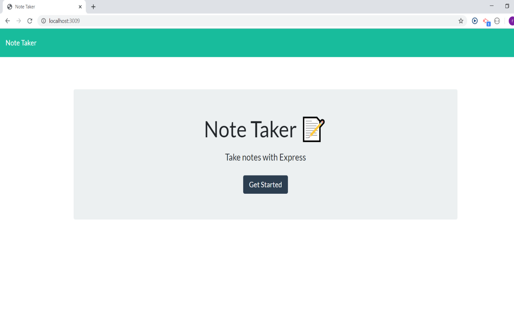
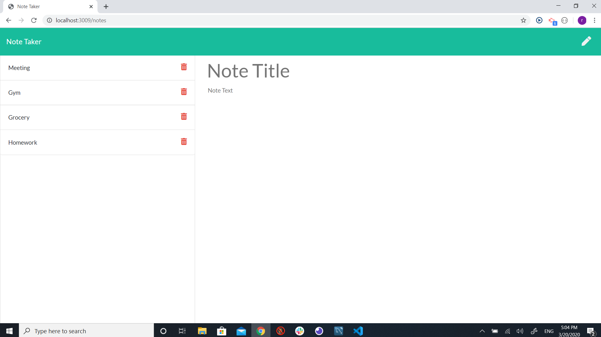
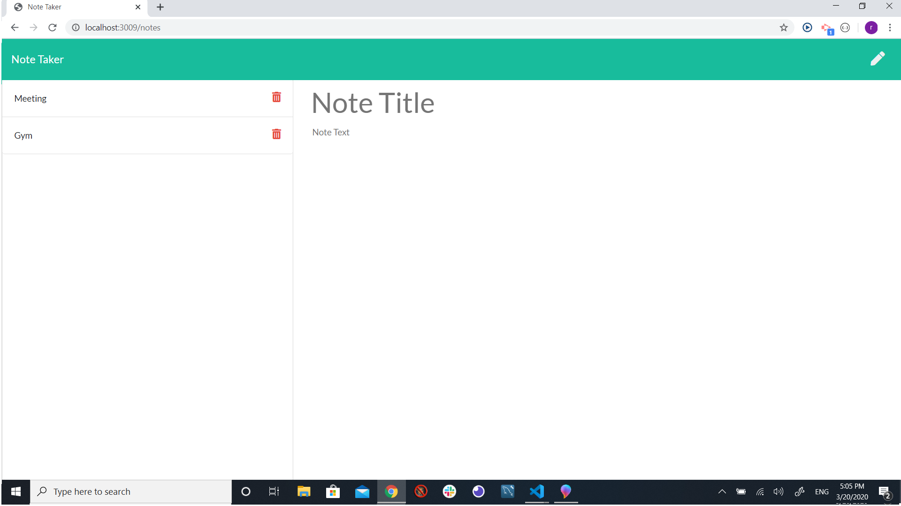
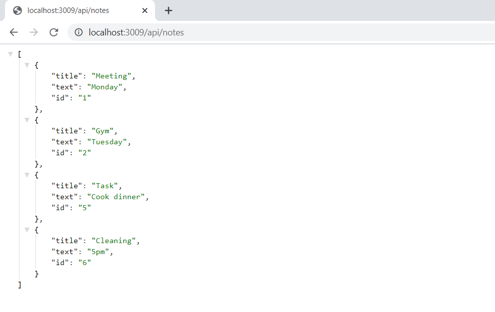

# note-taker-express
#### Use express to take notes. This app is using express to take notes at front end and saving data at the back end at the same time. 

There are two kinds of routes to connect the front-end and back-end. HTML routes and api routes. Html routes are used to connet the back-end data with html page. And the api rounts are performing the tasks like getting data from html pages and change the data according to the changeds make at the front-end html pages.

Here is the link to heroko deploy page: 

https://sue-note-taker.herokuapp.com/ 

You can get a general idea of how this app works by checking the screenshots below: 

